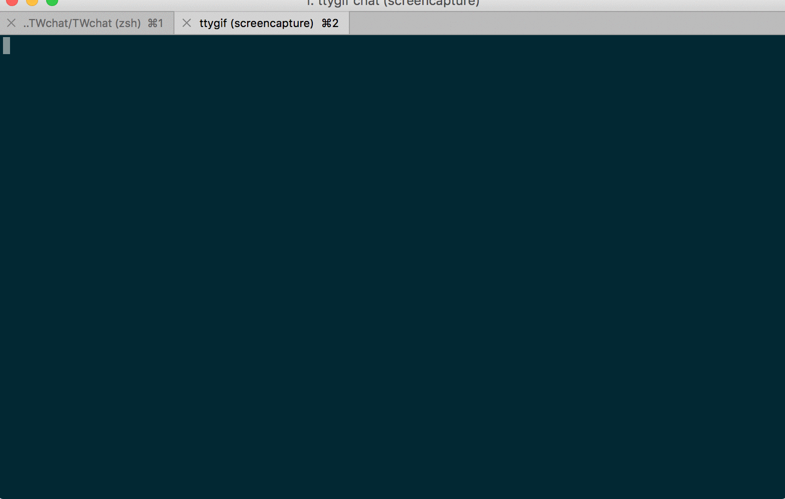

[](https://badge.fury.io/py/TWchat) [](https://travis-ci.org/huanglizhuo/TWchat)

```Text
 _____ _    _ _____  _   _   ___ _____ 
|_   _| |  | /  __ \| | | | / _ \_   _|
  | | | |  | | /  \/| |_| |/ /_\ \| |  
  | | | |/\| | |    |  _  ||  _  || |  
  | | \  /\  / \__/\| | | || | | || |  
  \_/  \/  \/ \____/\_| |_/\_| |_/\_/  
```

命令行下的微信客户端



目前在 macOS 上进行开发

理论上讲所有 Unix-like 均可用 (如有问题请提issue)

## how to install 

```
pip install TWchat -U
```

install mpg123
 
### macOS

```
brew install mpg123
```

## how to use

```
twchat
```

命令行会出现二维码，扫码登录

``` 
ALT+q  exit twchat
```

语音消息需要安装mpg123

支持图片 语音消息 该类型消息默认会存储到 HOME 目录的 .twchat

### Todo

- [ ] 添加未读消息提示
- [ ] 添加主题配置
- [ ] 支持联系人搜索
- [x] 支持图片语音消息
- [x] 完成基本文字聊天

[urwid](https://github.com/urwid/urwid) (Console user interface library for Python) 绘制界面

[itchat](https://github.com/littlecodersh/ItChat) (A complete and graceful API for Wechat) 访问微信网页版API
